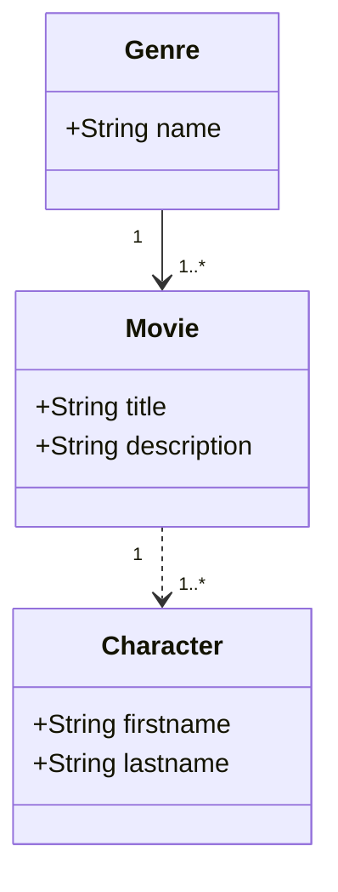

# articlePanache
Projet associé à l'article sur Panache Quarkus

# Modèle de données

# Build des projets depuis la racine

## Quarkus
mvn -pl sampleSpringData clean spring-boot:run
## SpringBoot
mvn -pl samplePanache clean quarkus:dev
